# **Finding Lane Lines on the Road** 

## Overview
This project is built in accordance with the **UDACITY** **_Self-Driving Car nano-degree program_** as part of **PROJECT-1**.
There are two python files containing a distinct pipeline for **_lane-detection_** for their respective videos as given below:
* solidWhiteRight.py   --   solidWhiteRight.mp4
* solidYellowLeft.py      --   solidYellowLeft.mp4
---

## User Manual
_Steps to use this Repository_

1.  watch the **solidWhiteRight.mp4** in test_videos.
2.  run the file **solidWhiteRight.py**  _(pipeline has been discussed further)_.
3.  watch the **solidYellowLeft.mp4** in test_videos.
4.  run the file **solidWhiteRight.py**  _(pipeline has been discussed further)_.
---

## Description
### Pipeline

**1.** **White Lane Detection**

* Getting frames from video
* Grayscaling - its easy to operate on 1 channel rather than 3 channel RGB
* Gaussian Blur - to remove noise for edge detection 
* Canny Edge Detection - to detect edges on the blurrd image 
* Masking - region of interest (ROI) is masked in order to remove extra lines which we don't want in output image 
* Probabilistic Hough transform - it connects the points to make _significant_ lines and returns starting and ending coordinates of  those lines
* Draw lanes 
	* classifying the lines as left line or right line based on the slopes
	* polyfitting the points left and right line to obtain a single line viz. left lane and right lane  
	* obtaining equation of left lane and right lane in terms of y = mx + b
	* extrapolating lines based on fixed coordinates in order to keep the length of the lane same
	* drawing these lines on black background
* Final Image -  weighted adding image and (black background containing lanes) to get final output 

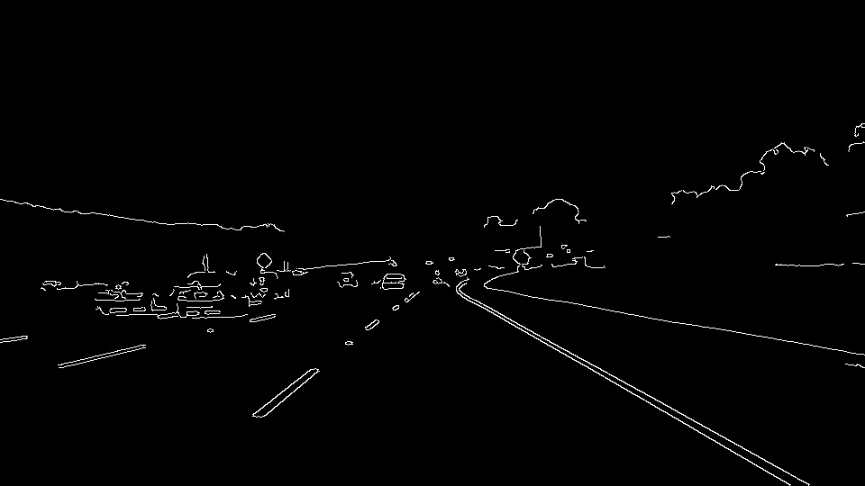

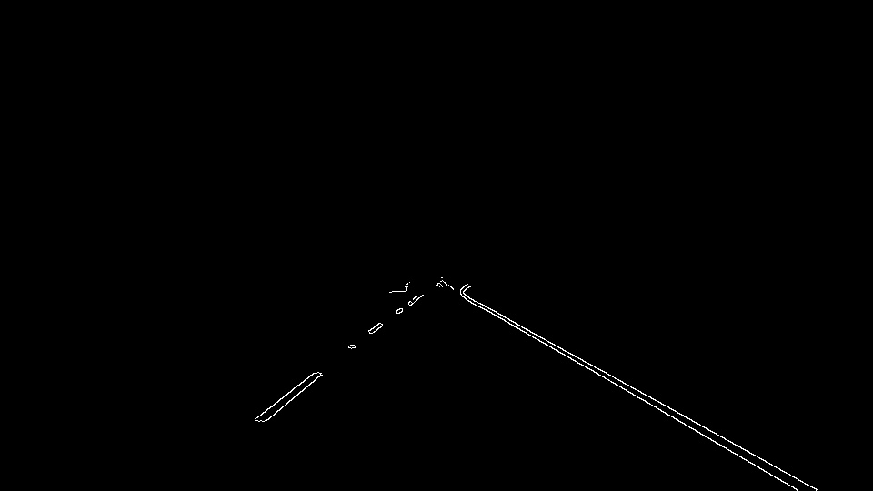

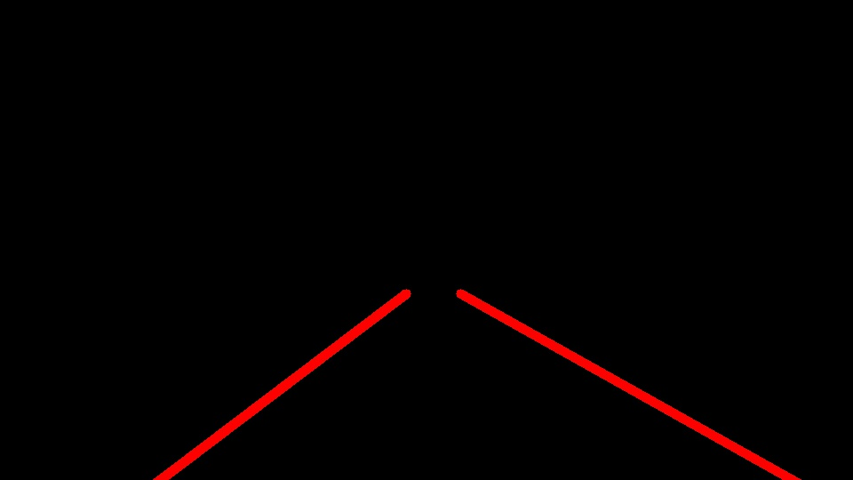
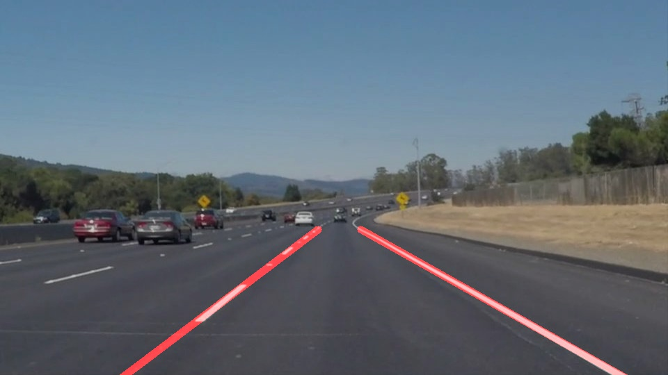

---
**2.** **Yellow Line Detection**
* Getting frames from video
* Gaussian Blur - remove noise _ at once as its kernel based method and hence takes time leading to dropping of frames_
* Yellow Channel Masking  - convert to HSV then deciding the upper and lower limit color filtering 
* White Channel Masking - simple binary thresholding
* Masking - masking white channel with ROI to remove excess noise
* Combining Mask - white channel masked + yellow channel masked
* Canny - edge detection on combined mask 
* Probabilistic Hough Transform - it connects the points to make _significant_ lines and returns starting and ending coordinates of  those lines
* Draw lanes -  _(same as above)_
* Final Image -  weighted adding image and (black background containing lanes) to get final output 

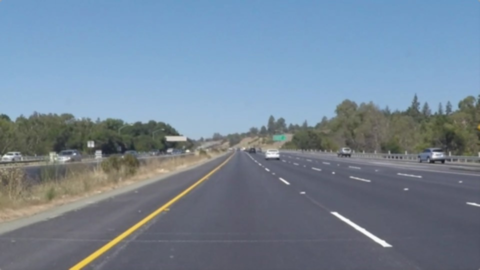
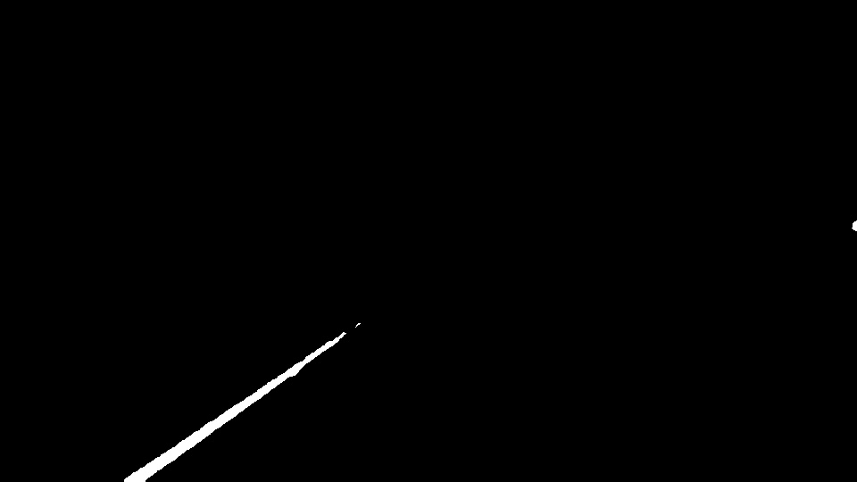
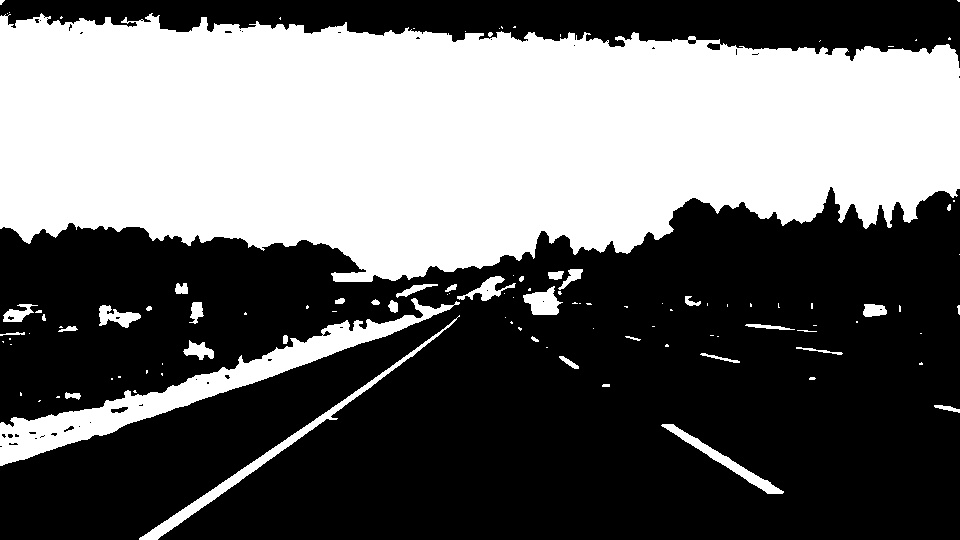

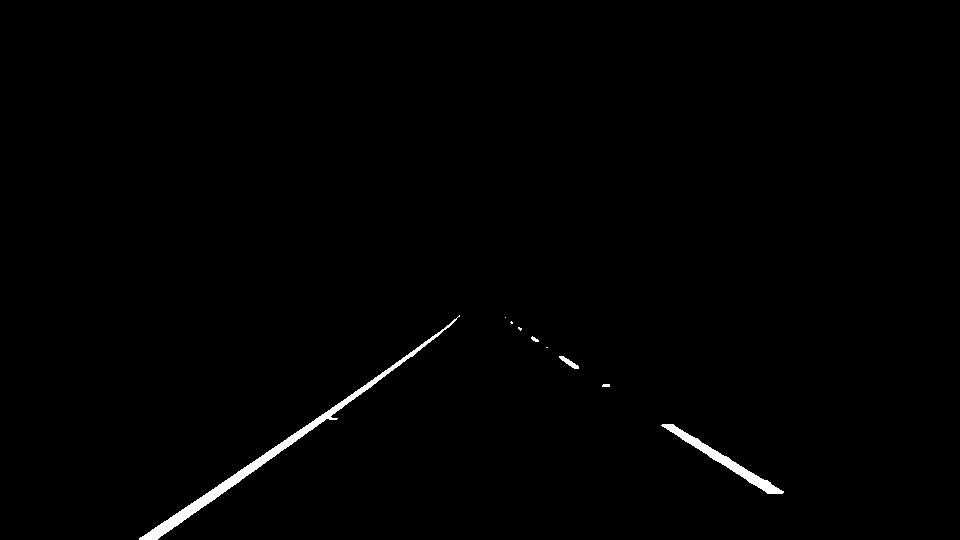
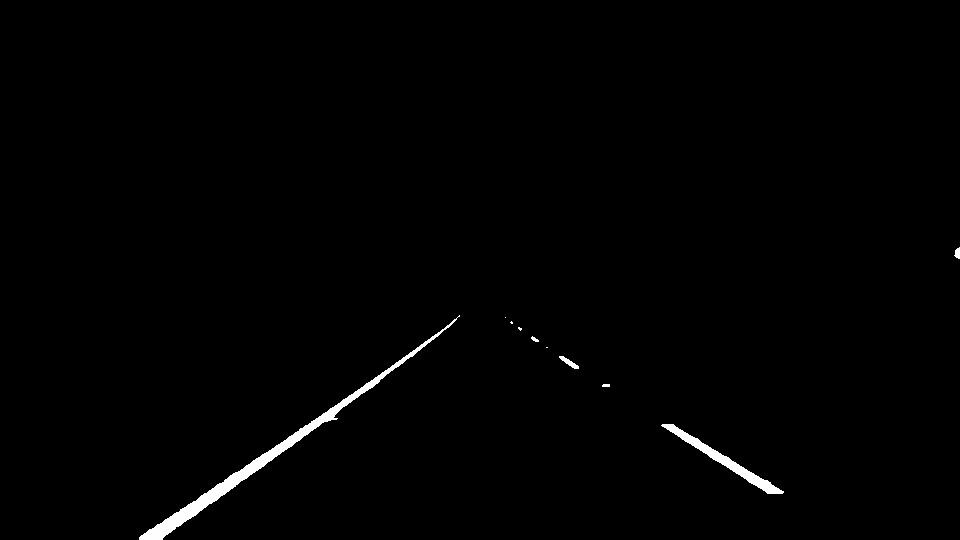
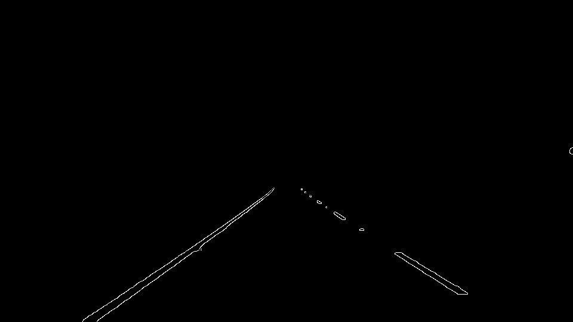
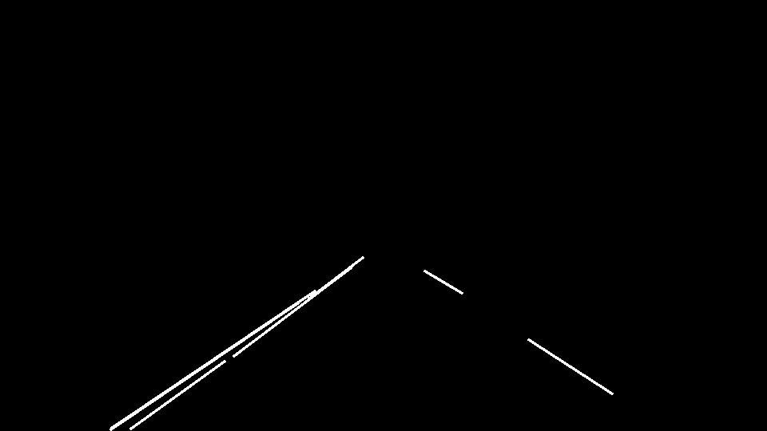
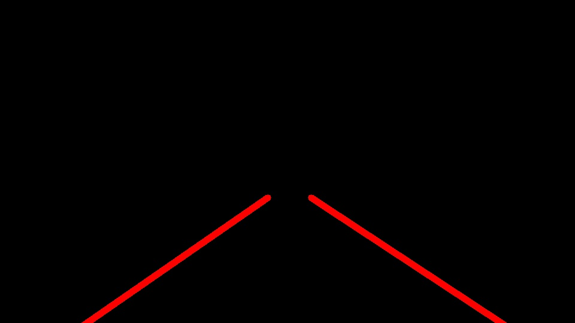
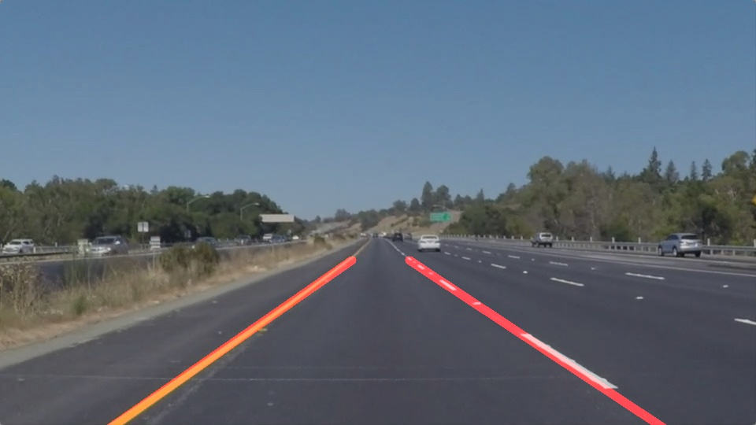

## 3. Potential shortcomings current pipeline

* Detected lanes are unstable and hence cannot be used to steering angle calculations
* Both the pipeline wouldn't work for curvy lanes
* extrapolating of lines to draw lanes is based on known coordinates

## 4. Possible improvements to current pipeline

* lines can be stabililzed by thresholding slopes values
* lines can also be stabilised by applying linear regression 
* in order to detect curvy lanes, legnth of the lanes has to compromised in this current pipeline
* extrapolating of lines can entirely be based on derived function asd not known coordinates 
